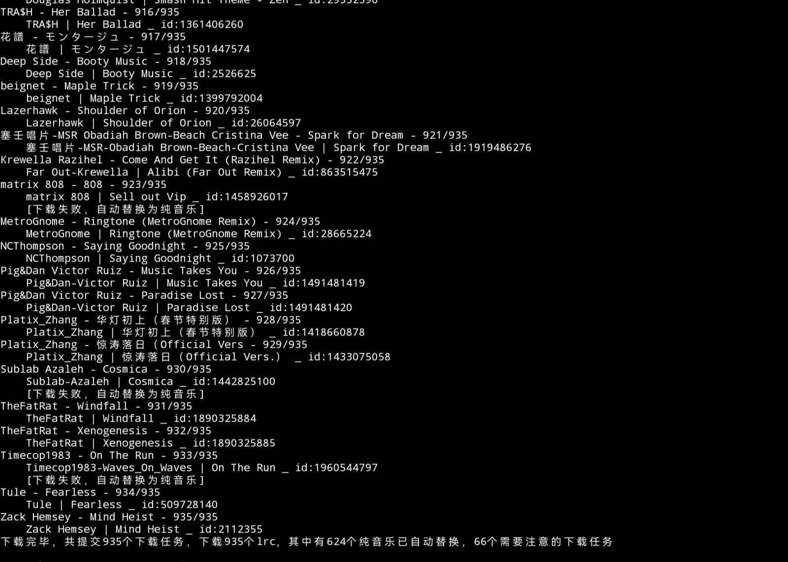
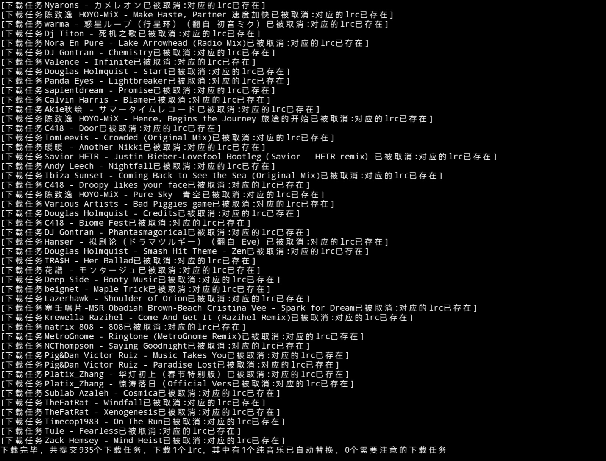

# music-lrc-match
### 基于Python，自动匹配并下载音乐对应的lrc歌词，自动操作，支持模糊搜索、纯音乐填充、自动防重、自动更新新文件等等
注:兼容网易云内所有音乐，其余音乐软件未做测试


## 使用  
环境:Python3  
下载`main.py`，运行即可。  
若提示缺少库，在命令行中执行`pip install <提示缺少的库>`

## 功能介绍
### 自动操作
全自动操作，只需输入音乐目录和要保存lrc的目录，即可自动运行，生成与对应音乐文件相同名称的lrc。    
### 模糊搜索
此程序将自动搜索并选择最佳匹配项，若出现相较本地下载的音乐名字与软件中有出入，可以做到一定程度的自动补正。
### 纯音乐填充
api返回纯音乐时的json无任何lrc内容，程序将自动生成带有`[00:00.00] 纯音乐 请欣赏`的lrc文件
### 自动防重&自动更新新文件
当原有lrc的列表中已存在对应lrc的时候，程序将自动忽略已有匹配的项目并转而更新新项目

### 错误提示
当提示[下载失败，自动替换为纯音乐]时，说明官方api返回的json中既没有歌词，也没有`nolyric`表示这是纯音乐  
这有两种可能:
1.可能网易云无这个音乐的版权
2.尚未有人贡献对应音乐的歌词

这些错误的音乐的文件名都存储在`errorlist`中，默认自动保留，如果想删除请在最后加入以下代码:(直接加入，不需要额外缩进)

``` python
for i in target_file:
    if i[:-4] in errorlist:
        os.remove(target_file+'/'+i)
        print('已删除'+i)        
```

## 依赖
1. [网易云音乐官方api](https://music.163.com/api/song/media?id=)
1. http://cloud-music.pl-fe.cn/  
## lrc使用
生成的lrc文件名与对应音乐的文件名相同，支持歌词显示的HIFI播放器一般将lrc文件与音乐文件放置于同一文件夹下即可，详见对应设备等的说明

## 关于
若出现api不稳定或者干脆出现bug的情况请在这里[提个Issue](https://github.com/RavelloH/music-lrc-match/issues/new)
### LICENCE
MIT @RavelloH 
